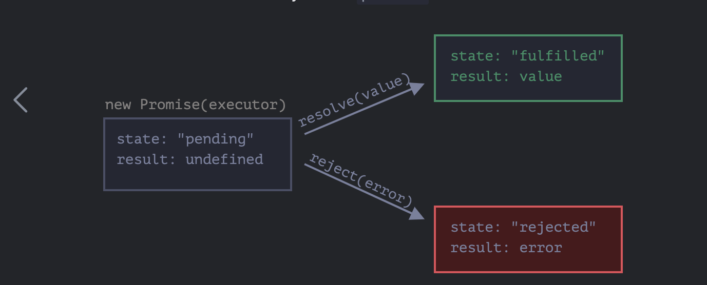
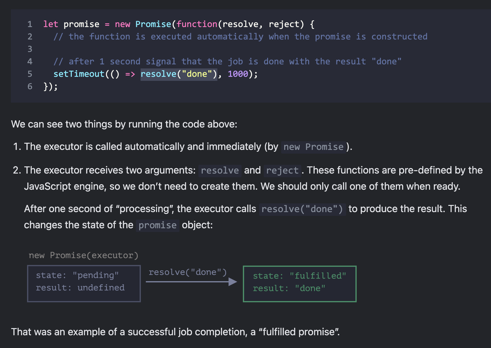
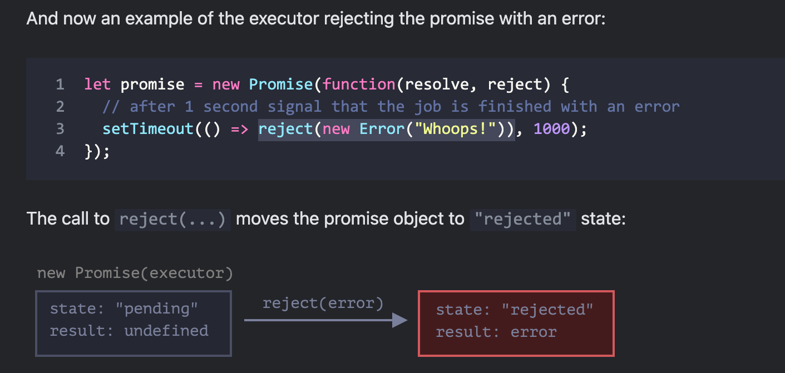

# JavaScript -Notes.

1. JavaScript is a scripting language: designed for execution at runtime in a specific runtime environment by an interpreter ( w/o the need to compile it into machine code)
2. Browser looks into each tage in HTML and converts them into objects. Its like < div > tag is parents object of < p > tag. This creates a DOM - Document Object Model tree. The browser breaks the tree and render the view based on it. Different to HTML, with JS, we have chance to modify the nodes of DOM tree : add new nodes, remove nodes, edit notes. This changes the view rendered by the browser. JS allows us to execute dynamic DOM tree on browser
3. JS is used for client side web development: with jQuery, AngularJS, React; it also used for server side development: with Node Js, Express; browser extension, desktop, mobile, IOT applications

## Variable: declaration (var) and definition (=)
- Declaration: no type declaration required. 
- Common type: number ( double, no integers - this is all floating point numbers), string ( no char type, only String type), boolean, undefined, null, symbol
- When we just declare the variable, its value is undefined (not yet filled). When we intend to leave the value empty, we define it as null ( not available). 
- the typeof operator: return type of a variable. Note: type of null is object. 
```js
var a = 5;
var b = 10;
var c = a + b;
var d = "Hello";
var e = true;
a = "hello a"; // no type declaration 
a = null;
console.log(typeof a);
```
## Primitive types and Reference types
1. Primitive type: Immutable, pass by values --> means their values cannot be chagned once created. When it is passed to a function or assigned to a new variable, it's actually the copy that was passed. Any changes made to this value do not affect the original value. 
```js
let num =10;
function modifyPrimitive(value){
    value=20;
}
modifyPrimitive(num);

console.log(num); // output: 10( unchanged)
```
When we assign a new value for  num, and we get a new value when we print num, it doesn't mean that value has changed, we just make num points to the new value
```js
num = 20; 
console.log(num) //output: 20
```
To prove this, we can use the Object.is() method to check if two values are exactly the same. This is particularly useful for demonstrating immutability of primitives.
```js
let x = 5;
let y = x;

console.log(Object.is(x, y));  // true - x and y reference the same value

x = 10;

console.log(Object.is(x, y));  // false - x now references a different value
console.log(y);  // 5 - the original value remains unchanged
```

2. Reference types: mutable, pass by reference -> means their value can be changed. When it is passed to a function or assigned to a new variable, what gets passed is a reference ( address) to the original object in heap memory. Any changes made this the object through this reference affect the original object. 

3. Difference to Java: 
## Declare variable with 'let' and 'const'

```js
let message ;
message ="Hello";
alert(message);
```
- Different to const keyword, means “constants”. With const declaration, variable cannot be reassigned. An attempt to do so would cause an error. Let allows reassign variables and declare multiple variables in one line:
```js
let user = 'John', age = 25, message = 'Hello';
```
- Similar to var, we can assign different value for variable message
- Different to var, declaring let  twice for 1 variable will triggers a SyntaxError. Var allows you to re-declare the same variable within the same scope without any error
- Different to var, it does have block scope {}. A let variable is only accessible within the block where it is declared. This means if you declare a varible inside an if statement, it will not be accessible outside that if block.
- Hoisting: with var, variable can be used before it is declared, but its value will be undefined until the line where it is initialised. It is different to let, variable will not be initialized, you will get a ReferenceError instead
```js
console.log(x);
var x =10;
```
- Hoisting creates problem because if we declare a variable with var inside a function, the declaration is moved to the top of that function's scope, but the assignment remains where it was orignally written:
```js
function example(){
    console.log(x);//undefined
    var x =10;
    console.log(x);//10
}
example();
```
- IIFE is created to alleviate this issue of hoisting, to prevent them from polluting the global scope or causing conflicts within loops
```js
var x =10;
(function(){
    var x =20;
    console.log(x);//
})();
console.log(x);
```
```js
for(var i =0; i<3;i++){
    (function(j){
        setTimeOut(function(){
            console.log(j);
        },1000);
    })(i);
}
```
- Above loop using let: let ensures that each iteration of the loop has its own scope for i, so the correct values are logged without needing and IIFE
```js
for(let i =0;i<3;i++){
    setTimeout(function(){
        console.log(i);
    },1000);
}
```
- If you declare a var variable globally, it becomes a property of the global object(e.g window), while let will not become property of the global object
## Type coercion: 
- Concatenation with String values
- Values of all types have an associated Bollean value


```js
123 + " 4" // return "1234"
```
## Nullish coalescing operator

The ?? operator provides a way to choose a defined value from a list of variables. The result of a ?? b is a unless it’s null/undefined, then b.

## Type conversion
- String conversion:

```js
let value = true;
alert(typeof value); // boolean

value = String(value); // now value is a string "true"
alert(typeof value); // string
```
- Number conversion:

We can use the Number(value) function to explicitly convert a value to a number:

```js
let str = "123";
alert(typeof str); // string

let num = Number(str); // becomes a number 123

alert(typeof num); // number
```
Numeric conversion rules:

```js
alert( Number("   123   ") ); // 123
alert( Number("123z") );      // NaN (error reading a number at "z")
alert( Number(true) );        // 1
alert( Number(false) );       // 0
```
- Boolean conversion:

```js
alert( Boolean(1) ); // true
alert( Boolean(0) ); // false

alert( Boolean("hello") ); // true
alert( Boolean("") ); // false
//in JavaScript, a non-empty string is always true.
alert( Boolean("0") ); // true
alert( Boolean(" ") ); // spaces, also true (any non-empty string is true)
```
## Equal (== OR ====)
- We use triple equals for precision check ( value + type match)
- Equal is just for value check
```js
var a =10;
var b = 20;
var c = "10";
var d = 0;
if(a==b){
    console.log("values are equal"); //not printed
}
if(a==c){
    console.log("values are equal"); // printed
}
if(a===c){
    console.log("values are equal"); // not printed
}
if(a){
     console.log("a is true"); // printed because a !=0. Falsy if a =0,"", undefined, null
}
if(d){
     console.log("a is false"); // printed because a == 0
}
```
## Objects 
- Not class based: unlike Java which depends on class template. Its free of form, you can add/remove anything in the object anytime
- Objects include properties( attributes/data) and methods(functionalities)
- No compilation step: if you access an property that does not exist --> it is an undefied property

```js
var person = {
    "firstName" : "kat",
    "middleName" : null,
    "lastName" : "M"
};
//if we try to access age property: person.age --> this returns undefined
// person.middleName --> null
```
- Object can have method
- the dot notation/ the square bracket [] notation: access property of object. The square bracket is specificaly used for case when the property name is invalid, like " 1" which is not accessible by dot notation

```js
var myObj = {}; //empty object
console.log(myObj); // return Object {}
myObj.prop = "Hello"; // define a property of MyObj 
// print : Object { prop : "Hello"} --> like adding key, value
myObj.prop2 = 123;
console.log(myObj); // print Object{ prop: "Hello", prop2: 123}
//OTHER OPTION: 
var myObj2 = {
    "prop":"hello",
    "prop1":123,
    "1": "one" // invalid variable name
}
console.log(myObj[prop]); // access prop property

console.log(myObj[1]);
```
- Property name is dynamic. We can assign the name of the property to a variable and get its value using the square bracket
```js
var myObj2 = {
    "prop":"hello",
    "prop1":123,
    "prop2": true
};
var propertyname = "prop1";
console.log(myObj[propetyName]);
```
- The dot notation is faster than square bracket because when the property name is known at compile time (compiled to machine code at runtime uses Just-In-Time compilation technique, during this process, the engines make optimizations based on the patterns they observe, including how properties are accessed). In contrast, the square bracket notation requires engine to evaluate the expression inside the brackets to determine the property name at runtime. So with square bracket, it adds an extra step which can slow down the process. With dot notation, the engine can quickly predict the property location in memory

### Deleting properties with the delete operator (delete)
- Whenever we want the property to disappear from the Object, we should not declare it as undefined but use keyword " delete" to remove the property
```js
delete person.middleName;
```

## Nested object

```js

var myObj2 = {
    "prop":"hello",
    "prop1":123,
    "prop2": true
    "objProp":{
        "innerProp": "Inner property"
    }
};

console.log(myObj2.objProp.innerProp); //  "Inner property" printed

Obj2.objProp.newInner = "new inner value"; // new property defined for objProp

console.log(myObj.objProp[newInner]); // "new inner value" printed
```

## Two objects pointing to the same address location

```js
var myObj = {
    "myProp":"hello"
};
var myObj2;
myObj2 = myObj;

console.log(myObj2.myProp);

// to check if two objects pointing to the same location address
if(myObj === myObj2){
    console.log("Variables are equal");
}

```

## Array

```js
var myArray = [100,200,300];
myArray[0]; 
myArray[1];
myArray[2];

```
- mix type
- if we access non-exist elements return undefined 
- add more items to the array: 

```js
myArray[3] = "hello";
```
- length of array --> myArray.length
- you can print the whole object
- an array is actually an object with properties named 1,2,3..--> therefore we have to user square bracket. JavaScript converts number 1,2,3 to String type.
- key in array has to be a number. Lets say we add new element with key =400:
  ```js
  myArray[400] = "world";
  myArray.length // return 401
  ```
### Array Methods
- Adding and removing elements at the last positon: myArray.push(50); myArray.pop()
- Adding and removing elements from the front of the array: myArray.unshift(42);myArray.shift()
- Look through the array and examine each and every elements of the array: myArray.forEach(function) - it takes function as an argument
```js
var myArray = [10,20,"hello",{}];
myArray.forEach(function(item){
    console.log("for an element"+item);
}); // print for an element 10 for an element 20...for an element [Object object]
```
- The format is: 

myArray.forEach(function(item,index,array){
    console.log(item,index);
});

index is where the loop starts. 
## Math object -> a built in object that has properties and methods for math constants and functions
1. Math.abs(x) -> returns the absolute value of a number
2. Math.ceil(x) -> round up a number
3. Math.floor(x) ->round down a number
4. Math.min, Math.max
5. Math.round(x)-> round a number to the nearest integer
6. Math.sqrt(x)
7. Math.trunc(x) -> returns the integral part of the number x, removing any fractional digits.

## Date object -> deal with date and time
1. Date.now() -> return date in milliseconds since 1 January,1970 UTC
2. var today = new Date()/ new Date('December 17,1995 03:24:00')/new Date(19995,11,17)/new Date(1995,11,17,3,24,0)/new Date('1995-12-17T03:24:00')
3. Date.getValue -> returns integer value representing the number of milliseconds
4. Date.getYear, Date.getMonth,Date.getDay,Date.getHour...second / and set as well

## Wrapper Objects in Java
- String is of primitive type. However we can use String.length --> this indicates that it is converted to String object. JavaScript automatically wraps primitives in objects when methods are called on them (autoboxing).
- 4 types of wrapper objects: String, Boolean, Number and Symbol

## Functions

1. Functions can be written in literal form
2. A function is a value that can be assigned to a variable
3. Functions are objects
4. Functions can be called by passing in arguments
5. Flexible argument count
6. No function overloading: no matter many arguments are passed,it's the same function
7. Default argument, arguments argument

```js
function sayHello(){
    console.log("hello");
}
sayHello(); // "hello" printed
```
- Arguments can be passed without declaring type
```js
function sayHello(name, timeOfDay){
    console.log("hello" + name + "time of day is" + timeOfDay);
}
sayHello("thuy","morning"); // "hello thuy time of day is morning" printed
```
- If we dont provide enough arguments, the undeclared arguments return undefined
- If we provide more than enough arguments, the non-exist arguments wil be ignore
- To return a value, just add return keyword. Result of a function with return keyword can be assigned to a variable
- If a function does not return anything, it returns undefined by default.
```js
function sayHello(name, timeOfDay){
    return "hello" + name + "time of day is" + timeOfDay;
}
var a = sayHello("thuy","afternoon") 
```
### Function Expression
- the function itself is a value in JavaScript. So a function without return keyword can also be assigned to a variable. This, we say the variable contains a function. --> function is also an object

```js
var f = function sayHello(){
console.log("hello");
}
f(); // this prints "hello"
```
- Annonymous function expression: notice that above function's name sayHello() is never used, so we can actually remove it:
```js
var f = function (){
console.log("hello");
}
f(); // this prints "hello"
```
### Function Declaration vs Function Expression
Function Expression: a function, created inside an expression or inside another syntax construct. Here, the function is created on the right side of the “assignment expression” =:

// Function Expression
```js
let sum = function(a, b) {
  return a + b;
};
```
---> in above example, it is created when the execution reaches it ( in intepretation phase) and hence, it is only usable from that moment. In contrast, function declaration is initialised during declaration phase, so it can be called or used earlier than it is defined:

```js
sayHi("John"); // Hello, John

function sayHi(name) {
  alert( `Hello, ${name}` );
}
```
CASE 1: if you want to use the function when JavaScript starts, use Function Declaration
---> The Function Declaration sayHi is created when JavaScript is preparing to start the script and is visible everywhere in it.
---> That gives us more flexibility in code organization, and is usually more readable.

CASE 2: if you want the function to be visible outside of block in strict mode, use Function Expression
---> Function Declaration has block scope and only visible inside the block ---> 
### Function as argument
```js
var f = function (){
console.log("hello");
}
var executor = function(x){
console.log(x);
}
var executor1 = function(x){
x();
}
executor(f); // this prints " function f()"
executor1(f); // this prints "hello"
var f1 = function (name){
console.log("hello " + name);
}
var executor2 = function(fn,name){
fn(name);
}
executor2(f,"thuy"); // this prints "hello thuy"
```
### Function as an object's property --> Method
- create method like how you create a property with anonymous function
- execute the method using classname.methodname()
```js
var myObj ={
"testProp" : true
};
myObj.myMethod = function(){
console.log("hello");
}
myObj.myMethod();// "hello" printed
console.log(myObj);// prints: Object{testProp:true,myMethod:myMethod()}
```
- "this" keyword: 

```js
var person = {
    "firstName":"kat",
    "lastName":"Nguyen",
    "getFullName" :function(){
        return person.firstName + " "+person.lastName;
    }
};
var fullName = person.getFullName();
console.log(fullName);
```
- The above code is fragile because it cannot have person variable changed. For example if we have :
```js
var person2 = person;
person = {};
```
If we hardcode like above, we will not be able to call the method and execute it. In order for this to work, for it to work with whaterver the object's name, we use keyword " this":


```js
var person = {
    "firstName":"kat",
    "lastName":"Nguyen",
    "getFullName" :function(){
        return this.firstName + " "+this.lastName;
    }
};
var fullName = person.getFullName();
console.log(fullName);
```

### default function argument
- In java, we declare a varargs parameter: 
```java
public void exampleMethod(String str,int... numbers){/*..*/}
```
this means the method can accept n integers. Inside the method, the varargs parameter is treated as an array. So, in the example above, numbers is actually an int[].
- In javaScript, you get this by default. You can pass "arguments" to a method as an implicit arguments.
-  Arguments value in JavaScript is not an array. It is array-like only that it has length property an allows access to its elements using index notation : arguments[0],arguments[1].However, it does not have array methods like forEach, map, etc. To use array methods, you need to convert it into a real array.
```js
var add = function(a,b){ // NOTE: we dont need to declare "arguments"
    console.log(arguments);
    return a +b;
};
console.log(add(10,30)); 
/*
Arguments { 0:10,1:30,2more...}
40
*/
var add2 = function(a,b){
    var i,sum = 0;
    for(i=0,i< arguments.length,i++){
        sum+= arguments[i];
    }
    return sum;
};
console.log(add(10,30,2,3,5,3));
```
- convert arguments into real array:
```js
let argsArray = Array.prototype.slice.call(arguments);
//or using spread operator
//let argsArray = [...arguments];
```

Other topics:
- Scopes and closures
- Objects and prototypes ( class type in JavaScript)
- Asynchronous JavaScript - Callbacks and Promises: because JS is a single threat program, so it is important to write asynchronous program for it to function smoothly
- Client side frameworks:jQuery, React, AngularJS
- Sever side framework: Node js - MVC

### Arrow functions
```js
let func = (arg1, arg2, ..., argN) => expression;

```
 it’s the shorter version of:
 ```js
 let func = function(arg1, arg2, ..., argN) {
  return expression;
};
```
more example:
```js
let sum = (a, b) => a + b;
//one argument, then parentheses around parameters can be omitted, making that even shorter.
let double = n => n * 2;
//If there are no arguments, parentheses are empty, but they must be present
let sayHi = () => alert("Hello!");
//can be used in the same way as Function Expressions.
let age = prompt("What is your age?", 18);

let welcome = (age < 18) ?
  () => alert('Hello!') :
  () => alert("Greetings!");

welcome();

```
Multi-arrow function: a more complex function, with multiple expressions and statements.We can enclose them in curly braces. The major difference is that curly braces require a return within them to return a value (just like a regular function does).
```js
let sum = (a, b) => {  // the curly brace opens a multiline function
  let result = a + b;
  return result; // if we use curly braces, then we need an explicit "return"
};

alert( sum(1, 2) ); // 3
```
### Arrow functions vs Normal Function: when to use??

### Optional Chaining

When we want to access inner properties of an object but unsure if they exist. For example: user.address.street

If the property exists, we want to return the value of the property, otherwise accept null value

Normally, it will be done like this for double nested object
```js
let user = {}; // user has no address

alert(user.address ? user.address.street ? user.address.street.name : null : null);
```
--->That’s why the optional chaining ?. was added to the language. To solve this problem once and for all!

The optional chaining ?. stops the evaluation if the value before ?. is undefined or null and returns undefined.

```js
let user = {}; // user has no address

alert( user?.address?.street ); // undefined (no error)
```
NOTE:
1. If there’s no variable user at all, then user?.anything triggers an error:
```js
// ReferenceError: user is not defined
user?.address;
```
The variable must be declared (e.g. let/const/var user or as a function parameter). The optional chaining works only for declared variables.

2. ?.() is used to call a function that may not exist.
```js
let userAdmin = {
  admin() {
    alert("I am admin");
  }
};

let userGuest = {};

userAdmin.admin?.(); // I am admin

userGuest.admin?.(); // nothing happens (no such method)
```
3. Also we can use ?. with delete:
```js
delete user?.name; // delete user.name if user exists
```
4. We can use ?. for safe reading and deleting, but not writing
The optional chaining ?. has no use on the left side of an assignment.
```js
let user = null;

user?.name = "John"; // Error, doesn't work
// because it evaluates to: undefined = "John"
```
### Asynchronous function: initiate now, finish later
1. Synchronous Functions: executed in order they appear in the code. Each function must complete before the next function starts executing. 
2. Asynchronous Function: Functions or code blocks that involve asynchronous operation like network requests, setTimeout, reading files which do no block the execution of subsequent code.The JavaScript runtime schedules these operations to be completed later, allowing other code to run in the meantime.

For example:
```js
console.log('A');
setTimeout(()=> console.log('B'),0); // this is asynchronous operation
console.log('C');
// output: A,C,B
```
3. Order of execution with Promisese:
- When a promise is created, executor funciton is immedite executed. It runs in order it appears like other Synchronous Code. 
- The callbacks passed to .then are not executed immediately; instead, they are scheduled to run asynchronously after call stack is cleared ( these are MicroTask Queue). Microtask queue is processed after the current synchronous code but before any other MacroTask Queue such as setTimeout callbacks.

Example: 
```js
console.log('Start');
setTimeout(()=>{
    console.log('Timeout 1');
},100);
let p = new Promise((resolve)=>{
    console.log('Promise executor');
    resolve('Resolved');
});
p.then((value)=>{
    console.log(value);
});
setTimeout(()=>{
    console.log('Timeout 2');
},50);
console.log('End');
```
#### Callback
- Example of asynchronous function
```js
function loadScript(src) {
  // creates a <script> tag and append it to the page
  // this causes the script with given src to start loading and run when complete
  let script = document.createElement('script');
  script.src = src;
  document.head.append(script);
}
```
- When the script is loaded, we want a function to execute right after --> this is callback function. 

---> a callback function is a function that is passed as an argument to another function and is intended to be called later within that function to complete some action. 
```js
function loadScript(src, callback) {
  let script = document.createElement('script');
  script.src = src;

  script.onload = () => callback(script);

  document.head.append(script);
}
```
---> the second argument is a function (usually anonymous) that runs when the action is completed.
- error handling
```js
function loadScript(src, callback) {
  let script = document.createElement('script');
  script.src = src;

  script.onload = () => callback(null, script);
  script.onerror = () => callback(new Error(`Script load error for ${src}`));

  document.head.append(script);
}
loadScript('/my/script.js', function(error, script) {
  if (error) {
    // handle error
  } else {
    // script loaded successfully
  }
});
```
--->It’s called the “error-first callback” style.

The convention is:

The first argument of the callback is reserved for an error if it occurs. Then callback(err) is called.The second argument (and the next ones if needed) are for the successful result. Then callback(null, result1, result2…) is called.

So the single callback function is used both for reporting errors and passing back results.
#### Promise
- The case of loading a sequence of script after the first one --> need to use Promises
--> Construction of Promises:
```js
let promise = new Promise(function(resolve, reject) {
  // executor (the producing code, "singer")
});
```
-->The function passed to new Promise is called the executor. It is the production code that runs automatically when a new Promise is created.Its arguments resolve and reject are callbacks provided by JavaScript itself. These functions are callbacks because they are intended to be called later within the executor function to indicate the outcome of the asynchronous operation.

**Resolve and Reject are functions**
a. Resolve(value)

Type of argument: any data type including :
* primitive values: resolve(42), resolve("Success"),resolve(true)
* Object: resolve({key:"value"})
* Array: resolve([ 1,2,3])
* Another Promise or Thenable: resolve(anotherPromise) - if the argument is another promise, the current promise will wait for it to settle and will adopt its state -> current Promise just need Resolve function

```js
let anotherPromise = new Promise((resolve)=>{
    setTimeout(()=> resolve("Another promise resolved"),1000);
});
let myPromise = new Promise((resolve)=>{
    resolve(anotherPromise); // passing another promise
});
myPromise.then((value)=> console.log(value)); //"Another promise resolved"
```

b. Reject(reason) : when called, it rejects the promise and passes the reason to the next catch() handler or the onRejected handler in the then() chain

Type of argument: any data type, but it's common to pass:
* Error Object: reject(new Error("Something went wrong"))

When we create an instance of Error object using new Error(message_string) the default behaviour is that name of error is "Error"- represent type of error; message property is whatever you provided inside the bracket. 

A custome error type can be created: 
```js
class CustomError extends Error{
    constructor(message){
        super(message);
        this.name= 'CustomError';
    }
}

let customError = new CustomError("This is a custom error");
console.log(customError.name); //"CustomError
console.log(customError.message);//"This is a custom error"
```
* Strings: reject("Operation failed")
* object: reject({code:500,message:"Internal Server Error"}) 

--> When the executor obtains the result, be it soon or late, doesn’t matter, it should call one of these callbacks:

resolve(value) — if the job is finished successfully, with result value. This is invoked when the operation completes successfullly to mark the promise as fulfilled and pass a result down to promise chain

reject(error) — if an error has occurred, error is the error object. It is used to make the promise as rejected and pass the error or reason for failure down the promise chain

- Internal properties of promise: state , result






- Simplified structure of Promise and .then:
```js
function Promise(executor){
    this._state = 'pending';
    this._result= undefined;
    this._onFulfilled = [];
    this._onRejected =[];

    const resolve = (value) => {
        if(this._state === 'pending'){
            this._state = 'fulfilled';
            this._result = value;
            this._onFulfilled.forEach(callback => callback(value)); //execute the callback function defined in .then
        }
    };
    const reject = (reason) => {
        if(this._state === 'pending' ){
            this._state = 'reject';
            this._result = reason;
            this._onRejected.forEach(callback => callback(reason));

        }
    };
    executor(resolve,reject);
}
Promise.prototype.then = function(onFulfilled,onRejected){
    ...
    if(this._state === 'fulfilled'){
        onFulfilled(this._result);
    }else if(this._state === 'rejected'){
        if(onRejected)onRejected(this._value);  
    }else{
        this._onFulfilled.push(onfulfilled); // if promise is pending, queue onFulfilled
        if(onRejected){
            this._onRejected.push(onRejected); // queue onRejected if provided
        };
    }
}
```
- "then" actually does two things: it executes or queue up functions in onFulfilled or onRejected arrays, and return  a new Promise object. So the full function of "then" will look like this: 

 ---> it creates  variables called fulfilHandler and rejectHandler. In each of this variable, it checks: 
    
    --> if onFulfilled is not a function, it immediately pass the value and state to the new Promise object
    
    --> if onFulfilled is a function, it executes that function. Now if the function returns a Promise, result.then(resolve, reject) means the code will wait for the executor inside the result Promise to complete its execution. it will use the value that the inner Promise (result) resolves with, this value is then passed to the resolve function of the outer Promise.The outer Promise is determined by the state of the result object (the inner Promise). Remember that resolve is actually a callback function that does 3 taks: change the state of Promise object, store the value and execute callbacks functions in the onFulfilled queue.
```js
Promise.prototype.then = function(onFulfilled, onRejected) {
    return new Promise((resolve, reject) => {
        const fulfillHandler = (value) => {
            if (typeof onFulfilled !== 'function') {
                resolve(value);  // Pass through the value if no onFulfilled
            } else {
                try {
                    const result = onFulfilled(value);
                    if (result instanceof Promise) {
                        result.then(resolve, reject);  // Handle returned promises
                    } else {
                        resolve(result); // Pass through the value if onFulfilled is not a promise
                    }
                } catch (error) {
                    reject(error);
                }
            }
        };

        // Similar logic for rejectHandler...

        if (this._state === 'fulfilled') {
            setTimeout(() => fulfillHandler(this._value), 0);
        } else if (this._state === 'rejected') {
            // Handle rejection...
        } else {
            this._onFulfilled.push(fulfillHandler);
            // Queue rejectHandler...
        }
    });
};
```
---> notice that promise can still be in pending mode when .then is called. Eventhough executor function is synchronously executed, it can contains asynchronous code inside such as setTimeout.

---> In this scenario, promise is in pending mode when .then is called and the callbacks functions added later by .then will be pushed to the arrays, waiting to be executed once the state of promise object is confirmed. 

Example:
```js
const p = new Promise((resolve,reject) =>{
    setTimeout(()=>{
        resolve('Resolve after 1 second');
    },1000);
});
//At this point, the promise 'p' is still pending
p.then(value ->{
    console.log(value); //This will log 'Resolved after 1 second' after the timeout
});
```

- In case something goes wrong, the executor should call reject. That can be done with any type of argument (just like resolve). But it is recommended to use Error objects (or objects that inherit from Error).

- To summarize, the executor should perform a job (usually something that takes time) and then call resolve or reject to change the state of the corresponding promise object.
A promise that is either resolved or rejected is called “settled”, as opposed to an initially “pending” promise.
- The properties state and result of the Promise object are internal. We can’t directly access them. We can use the methods .then/.catch/.finally for that. 
- Consuming functions can be registered (subscribed) using the methods .then and .catch.
```js
promise.then(
  function(result) { /* handle a successful result */ },
  function(error) { /* handle an error */ }
);
```

```js
let promise = new Promise(function(resolve, reject) {
  setTimeout(() => resolve("done!"), 1000);
});

// resolve runs the first function in .then
promise.then(
  result => alert(result), // shows "done!" after 1 second
  error => alert(error) // doesn't run
);
```

```js
let promise = new Promise(function(resolve, reject) {
  setTimeout(() => reject(new Error("Whoops!")), 1000);
});

// reject runs the second function in .then
promise.then(
  result => alert(result), // doesn't run
  error => alert(error) // shows "Error: Whoops!" after 1 second
);
```
- If we’re interested only in successful completions, then we can provide only one function argument to .then:
```js
let promise = new Promise(resolve => {
  setTimeout(() => resolve("done!"), 1000);
});

promise.then(alert); // shows "done!" after 1 second
```
- If we’re interested only in errors, then we can use null as the first argument: .then(null, errorHandlingFunction). Or we can use .catch(errorHandlingFunction), which is exactly the same
```js
let promise = new Promise((resolve, reject) => {
  setTimeout(() => reject(new Error("Whoops!")), 1000);
});

// .catch(f) is the same as promise.then(null, f)
promise.catch(alert); // shows "Error: Whoops!" after 1 second
```
OR: this will also work the same: ---> the code of a promise executor and promise handlers has an invisible try..catch around it. 

```js
new Promise((resolve, reject) => {
  throw new Error("Whoops!");
}).catch(alert); // Error: Whoops!
```
If we throw inside a .then handler, that means a rejected promise, so the control jumps to the nearest error handler.
```js
new Promise((resolve, reject) => {
  resolve("ok");
}).then((result) => {
  throw new Error("Whoops!"); // rejects the promise
}).catch(alert); // Error: Whoops!
```
Catch also catches accidental errors in handlers or executors
```js
new Promise((resolve, reject) => {
  resolve("ok");
}).then((result) => {
  blabla(); // no such function
}).catch(alert); // ReferenceError: blabla is not defined
```
If we throw inside .catch, then the control goes to the next closest error handler. 
For unhandled promise rejections or errors, JS engine generates a global error

NOTE: CATCH cannot directly catch errors from asynchronous operation within a Promise, unless they are explicitly handled using 'reject'. Since the Promise executor runs synchronously. Once its finishes executing, the Promise is considered settled even if it contains asynchronous operations. For example, in below code, the catch wont be able to catch the error:
```js
new Promise(function(resolve, reject) {
  setTimeout(() => {
    throw new Error("Whoops!");
  }, 1000);
}).catch(alert);
```
---> to handle this error, we should use 'reject' function:
```js
new Promise(function(resolve, reject) {
  setTimeout(() => {
    reject(new Error("Whoops!"));
  }, 1000);
}).catch(alert);
```
---> Or we can wrap in try-catch:
```js
new Promise(function(resolve, reject) {
  setTimeout(() => {
    try {
      throw new Error("Whoops!");
    } catch (error) {
      reject(error);
    }
  }, 1000);
}).catch(alert);
```


- The call .finally(f) is similar to .then(f, f) in the sense that f runs always, when the promise is settled: be it resolve or reject. It is to set up a handler for performing cleanup/finalizing after the previous operations are complete.


---> A finally handler “passes through” the result or error to the next suitable handler.
```js
new Promise((resolve, reject) => {
  setTimeout(() => resolve("value"), 2000);
})
  .finally(() => alert("Promise ready")) // triggers first
  .then(result => alert(result)); // <-- .then shows "value"
  ```
  --->A finally handler also shouldn’t return anything. If it does, the returned value is silently ignored.The only exception to this rule is when a finally handler throws an error. Then this error goes to the next handler, instead of any previous outcome.

#### Thenable
A handler may return not exactly a promise, but a so-called “thenable” object – an arbitrary object that has a method .then

```js
class Thenable {
  constructor(num) {
    this.num = num;
  }
  then(resolve, reject) {
    alert(resolve); // function() { native code }
    // resolve with this.num*2 after the 1 second
    setTimeout(() => resolve(this.num * 2), 1000); // (**)
  }
}

new Promise(resolve => resolve(1))
  .then(result => {
    return new Thenable(result); // (*)
  })
  .then(alert); // shows 2 after 1000ms
```

It can have an extended set of methods, but also be compatible with native promises, because they implement .then.This feature allows us to integrate custom objects with promise chains without having to inherit from Promise.

-->The Promise system treats the Thenable object similarly to a Promise.

-->It executes the then method of the Thenable object, providing its own resolve and reject functions.

-->The resolution of the Promise chain is delayed until the Thenable.then method calls resolve or reject

The initial Promise resolves with 1.
The first .then receives 1 and returns a new Thenable object with result (which is 1).
The Promise system recognizes that the returned value is a thenable (it has a then method).
Instead of passing this thenable directly to the next .then, the Promise system will call the then method of your Thenable object.
**Inside this "then" method:**
It alerts the resolve function (which is provided by the Promise system).
It sets a timeout to call resolve(this.num * 2) after 1 second.
The Promise system waits for either resolve or reject to be called inside the Thenable.then method.
After 1 second, resolve(this.num * 2) is called, resolving the Promise with the value 2.
This resolved value (2) is then passed to the final .then(alert), which displays it.
#### Why its good practice to return a Promise in onFulfilledHandler??
- In a Promise chain, each `then()` method returns a new Promise automatically. However, the behaviour of this new Promise depends on what you return inside the 'then()' callback: return a value -> the new Promise resolves with that value, return a Promise, the new Promise adopts the state and value of the returned Promise, if dont return anything the new Promise resolves with undefined
- The purpose of returning a new Promise: wrapping operations in a new Promise can control when the Promise chian continues(i.e, inject setTimeout() inside executor of the new Promise).This allows to incorportate non-Promise-based asynchronous operations into our Promise chain, ensuring that each step completes before moving to the next.

Example: 
```js
fetch('/article/promise-chaining/user.json')
  .then(response => response.json())
  .then(user => fetch(`https://api.github.com/users/${user.name}`))
  .then(response => response.json())
  .then(githubUser => new Promise(function(resolve, reject) { // (*)
    let img = document.createElement('img');
    img.src = githubUser.avatar_url;
    img.className = "promise-avatar-example";
    document.body.append(img);

    setTimeout(() => {
      img.remove();
      resolve(githubUser); // (**)
    }, 3000);
  }))
  // triggers after 3 seconds
  .then(githubUser => alert(`Finished showing ${githubUser.name}`));
  ```
#### Fetch
- fetch(url) : make a network request to the url and returns a promise. The promise resolves with a response object when the remote server responds with headers, but before the full response is downloaded -> need to call response.text() or response.json() to get a promise that resolves when full text is downloaded. This promise object of response.text() is settled with value of the text. 
```js
fetch('/article/promise-chaining/user.json')
  // .then below runs when the remote server responds
  .then(function(response) {
    // response.text() returns a new promise that resolves with the full response text
    // when it loads
    return response.text();
  })
  .then(function(text) {
    // ...and here's the content of the remote file
    alert(text); // {"name": "iliakan", "isAdmin": true}
  });
  ```

#### Async functions
- async keyword when placed before a function means : a function always returns a promise. 
```js
async function f() {
  return 1;
  //or we can write: return Promise.resolve(1) which does the same thing - makes a resolved promise with the given value.
}

f().then(alert); // 1
```
- await keyword : means wait until promise settles and returns it result
```js
async function f() {

  let promise = new Promise((resolve, reject) => {
    setTimeout(() => resolve("done!"), 1000)
  });

  let result = await promise; // wait until the promise resolves (*)
  //promise.then(alert) does the same thing that "done" will be displayed after 1 seconds. However its different in how it is executed. 

  alert(result); // "done!"
}

f();
```
---> with await, the function pauses at the await line until the promise resolves before moving to the next line of code, while with then(), the function continues executing immediately, and the then() callback is scheduled to run later when the promise resolves.

---> await also extracts the resolved value of the promise allowing us to work with it directly

---> it makes asynchronous code look and behave more like synchronous code within the async function. 
## Scopes
Part of program where variables can be accessed

- JavaScript has function scoping not block scoping in { } like java
```js
var name = "thuy";
if(name==="thuy"){
    var school = "accounting";
}
console.log(name); // "thuy" printed
console.log(school); // "accounting"
```
--> not yet creating a scope here, school variable can still be accessed, it is not confined in a block { }
---> if we put if block inside the function  then we cannot access school variable

```js
var name = "thuy";
function allocatedShool(){
if(name==="thuy"){
    var school = "accounting";
}
} 
allocateSchool() // whatever available outside allocateSchool also avail to allocateSchool, in this case is the name variable

console.log(school); // error!
```
- JavaScript when executing a function will look inside the function for the variable, if it is not there, it gonna look for that outside the function

```js
var name = "thuy";

function allocatedSchool(){
    
if(name==="thuy"){
    var school = "accounting";
}else{
    var school = null;
}
return school;
} 
var school = allocatedSchool()
console.log(school); // this returns "accounting" because JS use variable name = "thuy"
```
- if the function has argument, it will create a new variable, assign the value to that variable. It will not use the global variable
```js
var name = "thuy";

function allocatedSchool(name){
    
if(name==="thuy"){
    var school = "accounting";
}else{
    var school = null;
}
return school;
} 
var school = allocatedSchool()
console.log(school); // this returns null because JS use variable name = undefined
```

--> with argument, function will not use out of scope variable. Without argument, when variable inside its scope is not available, it will look for that variable outside of the scope. 

--> avoid using global variable: multiple Js scripts running when loading a webpage -> using global variables will make it accessible for all Js scripts. Secondly, there is a chance that the global variable's name can be clashed with name of a library's variable

--> Immediately invoked function expression (IIFE)

```js
(function(){
    var name = "thuy";
    console.log(name);
} )();
```
## read and write operations

```js
var a = 10;
var b;
b =a 
```
--> a is read operation and b is write operation

--> affect how js deals with error

--> if you use a variable without declaring it, it's ok to do write operation not read operation ( in non-strict mode only)

```js
foo =10; // run -> no error!
console.log(foo); // without foo =10, error will appear
```

--> if you declare the variable you can work with read and write operations, if you dont, you can do write operation--> Js creates the variable for you, but you cannot do read operation because Js does not create a variable in this case and hence it throws error

## window object

- Variable outside function is global scope. There is a root object that holds all global variables. The root or global object depends on which runtime you are using. 

--> When you run Js in a browser, the global object is window object : the window object -> load the page -> run Js

--> type window and hit run, we see "Window: about privatebrowsing" and underneath are all global variables it contains

--> whenever you create a global variable and run, this variable is added as property of window object. This happens behind the scence. This works the same for when function is created as well. 

## Compilation and interpretation

- In Java, flow is: source code -> compile -> executed. In Js, what you executed is the src code without creating intermediatery refine. However, there is also compilation step in a fraction of seconds in which browser looks into your src code and identifies things that it needs to execute -> then intepretation step happens and code is executed

- The intepretor just looks for variable in scopes (either global or function scope) to use in its execution. It cares about definition of variable not declaration -> look for the variable in associated scope, assign value to the variable. If it doesnt find any variable with the same name, it goes up one scope to global scope to check if its there. 

- If variable is not declared in function scope, it got created at the global scope where it looks for at last

```js
var a =10;
function myfn(){
    var b =a;
    console.log(b);
    c =100;
}
my fn(); 
```
variable c is created at global scope. --> always use var to declare variable

--> we can avoid this using Strict mode that blocking variable auto-creation in reading operation. This is helpful when we have a typo and Js creates a new variable when it does writing operation during interpreting stage.

## Strict mode -"use strict"
```js
"use strict";
var myName ="";
myname ="thuy"; // myname wont be created and it throws error
```
- It applies in the scope you declare "use strict" either in function or global

## Hoisting
- No matter where you declare the variable with 'var', since it is used for compilation step, it will always be read first eventhough you declare them at last in your script

```js
a =10;
console.log(b);
c++;
var a;
var b;
var c;
```

```js
myFn1();
function myFn1(){

};
```

--> this is important for recursive function

--> However this wont work for function expression: var a is created, but when we execute fn(), error is thrown because JS doesnt have the function name in its scope.

```js
fn();
var a = fn(){

};
```
## Closure

```js
var a =10; //execute first
function outer(){
    var b =20;
    var inner =function(){
        console.log(a);
        console.log(b);
    };
    return inner;
}
var innerFn = outer(); //execute next, now innerFn = inner 
innerFin(); // able to access variable a, but inner function is in global scope now and still be able to access variable b

```
--> for inner function to be executed outside outer function scope, Js actually remembers the original scope of inner function, so eventhough inner function is later executed out of original scope, it can still access variables available in the original scope. 

- Clossures: function that remember its scope where it is declared

## copies
- everytime we run the script, copy of variable/instance of variable is created. It is created for each execution
- variable b and variable a are referenced to by inner function, they are used and  not be cleared by garbage collector.Thats why closures is possible. However, its the snapshot of variable b or copy of variable that is created for each and every execution. In each execution, each inner function retains a reference to its own instance of b.

```js
var a =10; //execute first
function outer(){
    var b =20;
    var inner =function(){
        a++;
        b++;
        console.log(a);
        console.log(b);
    };
    return inner;
}
var innerFn = outer(); 
innerFin(); // 11 and 21 printed

var innerFn2 = outer(); 
innerFn2(); //12 and 21 printed --> new copy of b created for each execution of outer function
```

**Execution Flow**
1. First Call to outer:
- outer is called, creating a new execution context with b = 20.
- inner is returned, forming a closure over this specific instance of b.
- innerFn is assigned this closure.
- innerFn() increments a to 11 and b to 21, then logs these values.
2. Second Call to outer:
- outer is called again, creating a new execution context with a new b = 20.
- inner is returned again, forming a new closure over this new instance of b.
- innerFn2 is assigned this new closure.
- nnerFn2() increments a to 12 (continuing to modify the global a) and b to 21 (modifying the new instance of b), then logs these values.

--> In closures, the variables remembered by the closusre have their own new copies in every execution. However, variables in the scope where the execution happens do not get new copies each time. Copies do not mean duplicates but it means the snapshot of the variable is shared across executios of the closure. 

## closures in callbacks

```js
var a = 10;
var fn =function(){
    console.log(a);
};
setTimeout(fn,5000);
console.log("Done");
```
--> fin is executed somewhere else which does not have acess to variable a. Since closures is formed over variable a, it allows setTimeout to execute fn after 5 seconds.

## The module pattern

- How to prevent access to variable that supposed to be private -> use scope as the way to hide things -> enclosing variable in a scope -> create a function

```js
var person = {
    "firstName":"kat",
    "lastName":"Ma",
    "getFirstName":function(){
        return this.firstName;
    },
    "getLastName":function(){
        return this.lastName;
    }
}
console.log(person.firstName); //kat printed
console.log(person.getFirstName);//kat is also printed
//the goal here is to make kat printed only when we use person.getFirstName, not person.firstName
```
To hide firstName property of object variable: 
1. Place the object inside a function: 
```js
function createPerson(){
    var person = {
    "firstName":"kat",
    "lastName":"Ma",
    "getFirstName":function(){
        return this.firstName;
    },
    "getLastName":function(){
        return this.lastName;
    };
    return person;
}
};

var person = createPerson();
console.log(person.getFirstName());
console.log(person.firstName);
//"kat" is still accessible for both executions because firstName is available in person object scope still. 
```
2. Move the variables out of the scope to hide them and make them inaccessible: this way, the function remembers the variables as closures is formed, but in global scope, we are not able to access those variables. 
```js
function createPerson(){
    var firstName = "kat";
    var lastName = "Ma";
    var returnObj = {
    
    "getFirstName":function(){
        return firstName;
    },
    "getLastName":function(){
        return lastName;
    };
    return returnObj;
}
};
var person = createPerson();
console.log(person.getFirstName());
console.log(person.firstName);//undefined
```
## ES6 modules
- A module is just a script file. It can load other module using import and can be exported to other module outside it. 
- As module support special keywords and features, we must tell the browser that a script should be treated as a moudle by using < script type ="module" >. The difference between appending normal script and importing module is that modules have their own scope and dont auto add variables to the global scope. When importing module, we enable module-specific features: 
1. Top-level await: 

* Enable modules to act like a big async functions ( defer by default)
* allows await to be used directly in the global scope of module

2. Strict mode by default
*  avoid global variables to be created by accident. ( this is called silent errors)
```js
    // Non-strict mode
x = 3.14; // Accidentally creates a global variable

// Strict mode
"use strict";
x = 3.14; // Throws ReferenceError: x is not defined
```
* Avoid duplicated parameter names:
```js
// Non-strict mode
function sum(a, a, c) { // Duplicate parameter names allowed
    return a + b + c; // This actually uses the last 'a' parameter
}

// Strict mode
"use strict";
function sum(a, a, c) { // SyntaxError: Duplicate parameter name not allowed
    // ...
}
```
* Prohibit synctax likely to be used in future ECMAScript versions:
```js
// Non-strict mode
var interface = 'audio'; // 'interface' might be a future keyword, but this works

// Strict mode
"use strict";
var interface = 'audio'; // SyntaxError: Unexpected strict mode reserved word
```
* Preventing 'this' from being auto-bound to the global object
```js
// Non-strict mode
function foo() {
    console.log(this); // Window (in browser)
}

// Strict mode
"use strict";
function foo() {
    console.log(this); // undefined
}
```
3. Deferred by default ( like adding defer to a regular script)
- Regular Scripts will be executed as soon as they appear unless marked with async or defer -> block HTML parsing
- Meanwhile, module do not block HTML because they have defer attribute by default. They are executed only after the entire HTMl doc has been parsed. 
--> Modules guarantee that execution happens after parsing, while regular scripts may execute during parsing causing blockage.

4. Dependency management
- Specify which part of other file that is imported and used: import { add } from './math.js'. Meanwhile, regular scripts rely on the global scope and the order of script tags.
- Module keeps variables private unless exported while regular scripts add variable to the global scope once script is exposed. 
```js
// module.js
const x = 10;
export const getX = () => x;

// main.js
import { getX } from './module.js';
console.log(getX()); // 10
console.log(x);      // ReferenceError: x is not defined
```
5. Static and dynamic import with import keyword
```js
//static import - only avail for modules
// Can only be used at the top level of a module
import { add } from './math.js';

//dynamic import - improve the old way of using loadScript function which returns a Promise
// Can be used anywhere, returns a promise
const mathModule = await import('./math.js');
console.log(mathModule.add(2, 3)); // 5

//instead of : 
// Dynamically load a script
function loadScript(src) {
    return new Promise((resolve, reject) => {
        const script = document.createElement('script');
        script.src = src;
        script.onload = resolve;
        script.onerror = reject;
        document.head.appendChild(script);
    });
}

loadScript('math.js').then(() => {
    console.log(add(2, 3)); // 5
});
```
6. Modules are executed only once 
--> this allows changes made in 1st script that imports module visble in 2nd script that also imports module
--> this not only allows us to maintain state of the varible consitently across all scripts, but also allow us to configure modules
```js
// counter.js
let count = 0;
export function increment() {
    count++;
    console.log(count);
}

// main.js
import { increment } from './counter.js';
import { increment as inc } from './counter.js';

increment(); // Logs: 1
inc();       // Logs: 2
```
Meanwhile, in normal script: if we append the script twice:
```xml
<script src="counter.js"></script>
<script src="counter.js"></script>
```
```js
// counter.js
let count = 0;
function increment() {
    count++;
    console.log(count);
}

// In browser console
increment(); // Logs: 1
increment(); // Logs: 1 (count is reset because the script ran twice)
```
7. this is undefined in module( not bound to global object) while in regular script it refers to global object
```js
// module.js
console.log(this); // undefined

export function checkThis() {
    console.log(this); // undefined (in strict mode)
}

// main.js
import { checkThis } from './module.js';
checkThis();
```
## Closures in async callbacks
- This code prints i from 0 to 9: 
```js
var i;
for(i = 0;i<10;i++){
console.log(i);
}
```
- If I want to use setTimeout:
```js
var i;
var print =function(){
console.log(i);
};
for(i = 0;i<10;i++){
setTimeout(print,1000);
}
```
--> This code prints number 10 for 10 times
--> this happens because setTimeout queues up 10 times, waited for the loop to finish to be executed. When the loop finish, i =10 is intepreted before setTimeout queue which leads to above behaviour
--> to fix this issue, we needs to make function print refers to different value of i after each loop
--> we create an annonymous function inside the loop that wraps around the print function, setTimeout and value of i. This function is set to execute immediately after each loop which gives different value of i that each setTimeout refers to.
```js
var i;
for(i = 0;i<10;i++){
(function(){
    var currentValueOfI = i;
    var print =function(){
    console.log(currentValueOfI);
    };
    setTimeout(print,1000);

})();
}
```

## Prototypes for multiple objects
- To create multiple objects, we can create a function and populate the args : 
```js
function createEmployeeObject(firstName,lastName,gender,designation){
    var newObj = {};
    newObj.firstName = firstName;
    newObj.lastName = lastName;
    newObj.gender = gender;
    newObj.designation = designation;
    return newObj;
}
var empp = createEmployeeObject("kat","ma","F","sales");
```
- All above functions has common features that we need to initiate empty object and return the populated object. In order to make it simpler, JavaScript removes those and turn this type of function into "constructor". Since the variable declaration is removed, we use "this" keyword instead.
-  When calling a constructor, we add "new" keyword in front of the function call. 
```js
// CONSTRUCTOR IN JAVASCRIPT
function createEmployeeObject(firstName,lastName,gender,designation){
    // var newObj = {}; -> this is understood and removed
    this.firstName = firstName; // object's name newObj becomes "this"
    this.lastName = lastName;
    this.gender = gender;
    this.designation = designation;
    // return newObj; -> this is understood and removed
}
var empp = new createEmployeeObject("kat","ma","F","sales"); // new keyword is added
```
- Naming convention: name classes with initial-case such as: Employee, Bicycle, Vehicle.. for all functions that are used as constructor

## To default words for every function call: arguments , this
1.  In Js, there is a concept of global object. The global object depends on which runtime environment we are using to run Js. If we are using browser, the global object is window object. When we call a standalone function directly in global scope,  "this" will be referenced to the global object
```js
function a(){
    console.log("hello"); // prints "hello"
    console.log(this); // prints Window -> about: blank
}
a();
```
2. Function as object's property: "this" refered to the  instance of the object
```js
var obj = {"prop":"This is the object itself"};
obj.a = function(){
    console.log("hello"); // prints "hello"
    console.log(this); // prints the object 
}
obj.a();
```
3. Function as a constructor
```js
function a(){
    console.log("hello"); // prints "hello"
    console.log(this); // prints an empty object
}
new a();
```
4. Function inside a constructor that uses the constructor's property
```js
//function to be called in constructor mode
function Bicycle(cadence,speed,gear,tirePressure){
    this.cadence = cadence;
    this.speed = speed;
    this.gear = gear;
    this.tirePressure = tirePressure;
    this.inflateTires = function(){
        this.tirePressure += 3;
    }
}
// calling the function in constructor mode
var b1 = new Bycycle(50,20,4,25);
b1.inflateTires(); // this.tirePressure -> this refers to instance b1 which has tirePressure = 25
```
- Now I want to create a different object called Mechanic and pass the inflateTires function to this object

```js
function Mechanic(name){
    this.name = name;
}
var mike = new Mechanic("mike");
mike.inflateTires = b1.inflateTires; 
mike.inflateTires(); // this will be refered to mike now, how can fix the default reference in Js to make this refers to its original object instead?
```
## the call function .call()

```js
function a(){}
a.call(); //this is similar to a()
```
The difference is call( {} ) take an object as its argument. It binds the object to "this" keyword of function a --> you can choose which object you want to bind this keyword to. 

--> using call function in previous example:
```js
function Mechanic(name){
    this.name = name;
}
var mike = new Mechanic("mike");
mike.inflateTires = b1.inflateTires; 
mike.inflateTires.call(b1); // execute this we see:
/*
* Object{name:"mike",inflateTires:Bicycle/this.inflateTires(),tirePressure:NaN}
*/
// now we check b1 again we will see the tirePressure has changed!!
```
Note: This also can work in the same manner
```js
function Mechanic(name){
    this.name = name;
    this.inflateTires = function(b1){
       b1.inflateTires();  
}
}
var mike = new Mechanic("mike");
mike.inflateTires(b1);
console.log(b1);
mike.inflateTires(b1);
console.log(b1);
```
- If we create another object of Bicycle called b2 and call : mike.inflateTires(b2) --> this works as well.
- In this way we call the inflateTires method of Mechanic, which then call inflateTires() of b1.
- This only works if we wrap b1.inflateTires() inside a function that takes b1 as its argument. If we dont place b1 as an argument, this wont work if we want to pass, i.e b2 to the function. The only way to go around is re-define b1.
```js
function Mechanic(name){
    this.name = name;
    this.inflateTires = 
       b1.inflateTires();
    
  	
}
var mike = new Mechanic("mike");
mike.inflateTires;
console.log(b1);
mike.inflateTires;
console.log(b1);
```
- In above code, we forgot to wrap b1.inflateTires() inside a function, the second time we use mike.inflateTires gives the same result as the first time.
- This is because this.inflateTires = b1.inflateTires() immediately execute b1.inflateTires() and assign return value to this.inflateTires.
- Other way is this:
```js
var b1 = new Bicycle(40, 20, 4, 25);

function Mechanic(name) {
    this.name = name;
    this.inflateTires = b1.inflateTires;
}

var mike = new Mechanic("mike");
mike.inflateTires();
console.log(b1);
mike.inflateTires();
```
- In the above code, we are copying the reference to the inflateTires method from b1 to the mike object.
- However, the method inflateTires is likely designed to work with this pointing to an instance of Bicycle (i.e., b1). When you call mike.inflateTires(), this now points to mike, not b1. Since mike is an instance of Mechanic, not Bicycle, any code inside inflateTires that relies on this to reference properties or methods of Bicycle will fail or behave unexpectedly.
- Again, we need to use .call or .bind:
  ```js
  var b1 = new Bicycle(40, 20, 4, 25);
  
    function Mechanic(name) {
        this.name = name;
        this.inflateTires = b1.inflateTires.bind(b1);
    }
    var mike = new Mechanic("mike");
    mike.inflateTires();  // Now works correctly
    console.log(b1);
    mike.inflateTires();  // Works again
```
```
## prototypes
- In above code, the function value of inflateTires variable is created everytime a new instance of Bicycle is created
- Everytime a function is created, there are 2 objects created: the function object and a prototype object
- To access the prototype object: function_name.prototype -> return the prototype object
- Lets say we have an empty constructor a(), if we create an instance out of this : 
```js
function a(){};
var myObj = new a(); // print myObj we get the prototype object
a.prototype.test = "This is the prototype object";
myObj.__proto__.test; // this print " This is the prototype object"
a.prototype === myObj.__proto__ ;// return true
```
--> accessing using .prototype or _ _proto_ _ , we get the same prototype object.
- If we try to access a property that does not exist inside object, JS will go and look for it in the prototype object

```js
myObj.hello; //prints undefined
myObj.__proto__.hello = "this value is from the prototype"; // this is called dunder-proto
myObj.hello ;// prints "this value is from the prototype"
```
- Now if we assign a new value for "hello" property inside myObj, new property is created that has new value, which is no longer the property from the prototype anymore.
- If we delete the newly assigned value, myObj.hello again being looked up from the prototype object. 

--> If we access a property from an object myObj.hello, it can be from prototype object or the object itself.

- Multiple objects being created from the same constructor/function --> they share the same prototype object --> they share the same properties contained in prototype object

--> This way we create behaviours applied to multiple objects. 

--> Functions defined in prototype object will not be created multiple times when new instance of object is created.

--> You can add properties to prototype object at runtime and it will be available to all instances ( which is different to Java which you have to define all functions before execution )
### identify the function/constructor that create an object
- function .prototype points to prototype object. The prototype object also has method .constructor that points to the function

```js
function a(){};
a.prototype ;// this prints the prototype object
var b = new a();
b// this prints the prototype object. when inspecting b, it appears to show properties fromthe prototype, but b is not hte prototype itself, it just has access to the prototype's properties
var c = a.prototype 
c.constructor // this prints function a()
b.constructor //this prints function a()
// eventhough b is an instance of a, b.constructor is equivalent to b.__proto__.constructor, which ultimately points ot a.prototype.constructor.
```
-->  we can get the function that create a particular object: using _ _proto_ _ and .constructor
```js
b.__proto__.constructor // this returns function a()
```
--> this is not recommended to use function this way because we can change the function associated with b._ _proto_ _.constructor

```js
b.__proto__.constructor = function d(){};
c.__proto__.consturctor // it prints function d()
```
## Global function : Object
```js
console.log(Object) // this print function Object()
```
- Another way to create new empty object apart from assigning {} is using Object function in constructor mode:
```js
var simple = {}
var obj = new Obj();
```
- This Object function in constructor mode also has a prototype object. This is the common object with "simple" object
```js
simple.__proto__ === obj.__proto__ //return true
```

- When we create a function named A, and object instance of function named a, a prototype object is automatically created. This prototype object is actually created using Object() function, and points to Object's prototype
```js
function Employee(){};
var emp = new Employee();
emp.prop="Employee";
emp.__proto__.parentProp="Parent of Employee";
emp.parentProp; // this return "Parent of Employee"
emp.__proto__.__proto__===Object.prototype; // return true
Object.prototype.grandparentProp = "grandparent";
emp.grandparentProp ; //this return "grandparent
```
- Using Object.prototype like this we can implement property that available to all objects in our system.
## Inheritance in JavaScript
- Now if we want to create a Manager object that inherits properties of Employee but still has its own properties
```js
function Employee(name){
    this.name = name};
Employee.prototype.getName =  function(){return this.name}; // function is created in prototype object so it will not be created again and again everytime we create an instance of Employee
var emp1 = new Employee("Jim");
emp1.getName();
function Manager(name,dept){this.name = name;this.dept = dept};
Manager.prototype.getDept = function(){ return this.dept;};
var mgr = new Manager("Micheal","Sales");

console.log(mgr.getName()) // return error!
```
-  to make mgr to accessible to .getName(),we can either place .getName method inside Object's Prototype OR we make Manager's Prototype points to Employee's Prototype
  

```js
mgr.__proto__.__proto__ === Object.prototye ; // return true
mgr.__proto__.__proto__ = Employee.prototye

console.log(mgr.getName()) // now return Micheal!
```
### Function in JavaScript vs Function in Java
- We are not able to define a function inside another function in Java, we can only call the function defined outside. However, in JS, we are able to define a function inside another function. This is because all functions in JS are basically objects. 
- When a function is defined inside another function, the outer function can provide access to inner function by return the inner function. If multiple functions exist, we can return an object which has all inner functions as its properties { function1, function2, ...func}. Closures will be formed on all variabled defined inside the outer function.
- The outer function can act like a constructor. In this sense, we use "this" keyword infront of all inner functions and variables to provide accessity to these inner functions. The return statement is disregarded. 
```js
function Counter() {
    let count = 0;
    this.increment = function() {
        count++;
        console.log(count);
    };
    this.decrement = function() {
        count--;
        console.log(count);
    };
}

const myCounter = new Counter();
myCounter.increment(); // Output: 1
myCounter.increment(); // Output: 2
myCounter.decrement(); // Output: 1
```
- ES6 provides a morden approach where "class" keyword is used. It just looks like Java format : class MyClass{ ...}. All methods declared inside this class will be bound to prototype object of MyClass -> MyClass.prototype.method, which makes them available to all instance of MyClass. Among these method, we have Constructor() method which we use "this" keyword to define all variables bound to MyClass. Format of ES6 class: 
```js
class ClassName {
  // Constructor method
  constructor(param1, param2) {
    this.property1 = param1;
    this.property2 = param2;
    this._privateProperty = 'I am private';
  }

  // Instance method
  instanceMethod() {
    console.log('This is an instance method');
  }

  // Getter method
  get someValue() {
    return this.property1;
  }

  // Setter method
  set someValue(newValue) {
    this.property1 = newValue;
  }

  // Static method
  static staticMethod() {
    console.log('This is a static method');
  }

  // Private method (proposed, not yet widely supported)
  #privateMethod() {
    console.log('This is a private method');
  }

  // Public method that uses the private method
  usePrivateMethod() {
    this.#privateMethod();
  }
}

// Inheritance
class ChildClass extends ClassName {
  constructor(param1, param2, extraParam) {
    super(param1, param2); // Call parent constructor
    this.extraProperty = extraParam;
  }

  // Override parent method
  instanceMethod() {
    super.instanceMethod(); // Call parent method
    console.log('This is an overridden method');
  }

  // Child-specific method
  childMethod() {
    console.log('This is a child-specific method');
  }
}
```

## Interaction: alert, prompt, confirm
- Alert: It shows a message and waits for the user to press “OK”.The mini-window with the message is called a modal window. The word “modal” means that the visitor can’t interact with the rest of the page, press other buttons, etc, until they have dealt with the window. In this case – until they press “OK”.
- Prompt:   
```js
// result = prompt(title, [default]);
let age = prompt('How old are you?', 100);

alert(`You are ${age} years old!`); // You are 100 years old!
```
--> It shows a modal window with a text message, an input field for the visitor, and the buttons OK/Cancel. default is optional, it's the initial value for the input field. Title is text showing to user.Prompt is shown,then we get that text in the result. Or user can cancel the input by pressing Cancel or hitting the Esc key, then we get null as the result.
--> The call to prompt returns the text from the input field or null if the input was canceled.
--> The second parameter is optional, but if we don’t supply it, Internet Explorer will insert the text "undefined" into the prompt.So, for prompts to look good in IE, we recommend always providing the second argument:

```js
let test = prompt("Test", ''); // <-- for IE
```
- Confirm:

The function confirm shows a modal window with a question and two buttons: OK and Cancel.
```js
// result = confirm(question);
// The result is true if OK is pressed and false otherwise.
let isBoss = confirm("Are you the boss?");

alert( isBoss ); // true if OK is pressed
```


